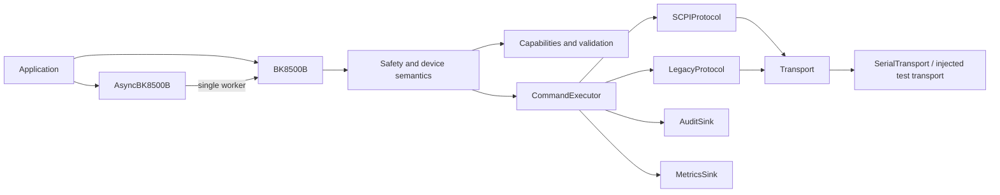

# Software architecture

## Component map

## Ownership

- `transport/`: byte I/O only; no device semantics.
- `protocol/`: framing, parsing, checksums, and scaling.
- `execution.py`: one session lock, pacing, deadlines, retry classification, outcomes.
- `state_machine.py`: authoritative session and transaction transitions.
- `capabilities.py`: model normalization, rating fallbacks, feature classification.
- `device.py`: stable synchronous API and safety transactions.
- `async_device.py`: one-worker facade around the synchronous engine.
- `diagnostics.py`: extension protocols and structured events.

No transport, active session, cache, retry counter, or safety state is global.

## Request lifecycle

1. Validate public arguments before I/O.
2. Verify the current session state and capability.
3. Acquire the one session lock with a finite deadline.
4. Apply command pacing.
5. Write once.
6. Read a bounded response when applicable.
7. Strictly parse and verify.
8. Emit one terminal outcome and release the lock.
9. Invalidate or update cached state.

A state-changing write that might have begun but does not complete is never replayed automatically.
